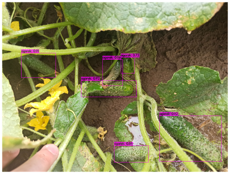
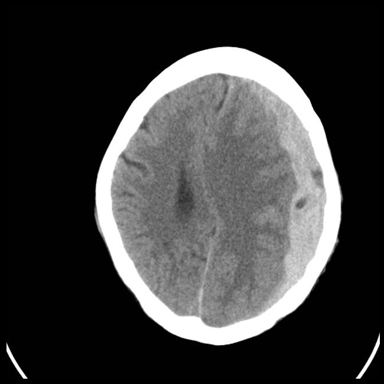

# Few words about myself...

My name is Jan Tyc and I am a 3rd year student of Biomedical Engeenering and 2nd year student of Informatics and AI on Univeristy of AGH in Cracow.

Main intrests of mine include widely meant Machine Learning (specificly Computer Vision, Object Detection and things connected with Neural Networks as all).

I also take a great intrest in non-science fields. Practicing bouldering is my biggest getaway, I've been doing it for about a year now. 

With my friend, Mateusz Piątek, we are hosting a podcast called 'Optymalizatorium' which covers technology usage, psychology and much more current urgent topics.

[Link to latest episode](https://open.spotify.com/episode/7erSIiqzIvcJ9TmGO9qXRZ)

# Currently hosted project:
## (field: Biomedical Engeenering)

1. Projekct 'Ogórki' (eng. Cucumbers) - My Engineer's Thesis, detection of ridge cucumbers in natural enviorment on the basis of YOLO algorithm

[Ogórki repo](https://github.com/tycjantyc/YOLO_ogorki) (still in progress, DM me for more info)

[Raport](YOLO_raport.pdf)

[Presentation](JanTyc_projekt_naukowy.pptx)

2. Classification of hemorphage using Topological Data Analysis combined with CNN (project realised for course 'Medical Imaging')

[TDA and CNN](https://github.com/tycjantyc/TDA)

[DenseNet](https://github.com/tycjantyc/ProjektTOM)

## (field: Informatics & AI)

1. Aplication "Top Beer"
2. Compiler of Java into C++ source code

# Closed projects:

Project realised for course 'Health Technology Innovation Generation' about medical capsules and broad sense of future of medicine and Healthcare Digital Assistants. 

[LINK TO PRESENTATION](https://docs.google.com/presentation/d/1fipnmH2sgFDSk7NSkCGgP6dxX7Y-u2-DZ63AycYRyB0/edit?usp=sharing)

